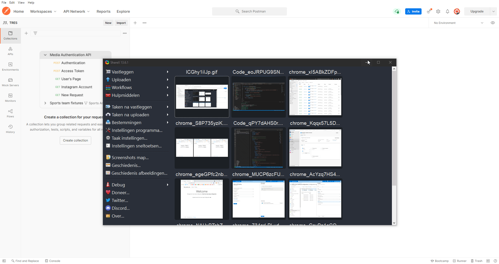
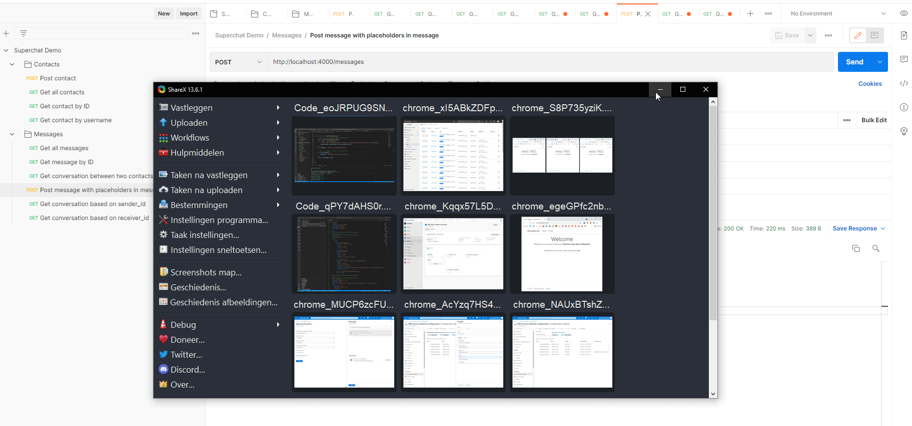

# superchat-backend-challenge-jeroensmink
Coding Challenge repo for superchat done by Jeroen Smink 2021

## How to run
Make sure you have Docker installed, then from the root of the project run `docker compose build` to build the Node.JS API. When that's finished run `docker compose up --force-recreate`. Docker will create the environment. Postgres has a special mount where I made sure a script is run to create and fill the database used in this project.

**Techstack used**
- Node.js
- Postgres
- Docker 🐳

In the `src` directory you will find the source. Most logic is handled by the controllers and routes are placed in a seperate folder. These routers are later added to the `app` process of Node.JS

By default the Node API will run on **port 4000** and postgres on **5432**

The seeder was only used for local development and is not run when the application starts, a few test entries are added by the **.sql** script postgres executes.

**Viel spaß!**

## About the project

- ✔ Create contacts given their personal information (Name, E-Mail, etc)
- ✔ List all contacts
- ✔ Send a message to a contact
- ✔ List all previous conversations
- ❌ Receive messages from an external service via a webhook
- ✔ Name of contact
- ✔ Current Bitcoin Price in $

Few things to know:
- In this example every user is a contact by itself,
- A contact can send a message to another contact based on it's id
- A message always has 3 properties, a `content`, a `sender_id` and a `receiver_id`. Both these ID's are foreign key relations to a contact
- The content propertie of a message can contain two special tags, either `{btc}` or `{receiver_id}`. When these tags a present the application will notice it during posting the message and will replace the value's of these tags with either the current BTC price in USD retrieved from Coinbase, or the username which is retrieved from the database when posting the new message and then the tag is replaced with the username value.

In the postman collection you can checkout all the different routes and methods.

See the GIF on how to import the collection into postman

## Test the API
In the root of the project you will find a `Superchat Demo.postman_collection.json` import this file into Postman so you can test the API yourself with predefined HTTP requests.

## Acknowledgement
- This was the first time working with Postgres, I must say I kind a like it and would use it in future project 😀
- Don't expect that all API routes are 100% monkey/fool proof, There must be some funky ways you can kill the application _Feel free to test out 😁_

# Demo GIF

## Place holder in text
The API allows for use of special text in the content body of the request, the user can use **{btc}** to get the current BTC price in USD or **{receiver_id}** to get the username of the person who will receive the message

